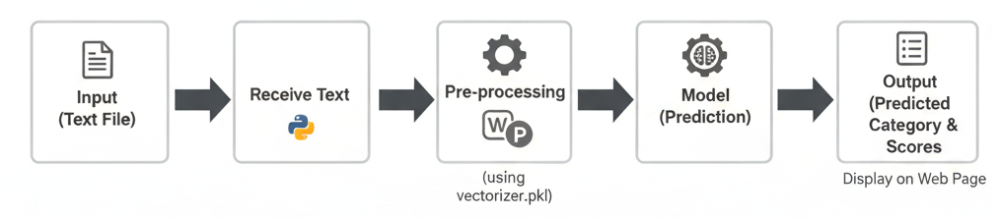

# News Article Classification NLP Flask API

A **smart NLP-powered system** that automatically classifies news articles into categories like **Politics, Sports, Entertainment, and Technology**. Built with **Python** and **Flask**, it provides a **REST API** for real-time predictions, making it easy to integrate into any application for automated news analysis and content recommendation.

---

## Model Files

The trained model files for this project are available for download from Kaggle:

[Download Model from Kaggle](https://www.kaggle.com/code/abdelazizariri/projet-nlp-news-category-classifier/output)  <!-- Replace # with your Kaggle link -->

The following files are required to run the project:

- `model_svc.joblib` – LinearSVC model    
- `tfidf_vectorizer.pkl` – TF-IDF vectorizer  

Make sure to download all three files from the Kaggle notebook output to correctly load and use the model.
---
## 🧠 Pipeline Overview



**Workflow**

1. **Input Text** – News text is submitted via a web page or API  
2. **Backend Receives Text** – Flask handles incoming requests  
3. **Pre-processing** – Cleaning + TF-IDF vectorization (`vectorizer.pkl`)  
4. **Model Prediction** – ML classifier predicts the category  
5. **Output** – Predicted class + confidence scores displayed in UI  

---

## Backend (Flask)

The backend is built using **Flask**, which serves the trained model and handles API requests from clients. The API can be accessed locally or deployed on a server for production use.

---

## Model

- **Vectorization:** TF-IDF (Term Frequency-Inverse Document Frequency)  
- **Classifier:** Linear Support Vector Classifier (**LinearSVC**)  
- **Utilities:** Preprocessing functions are implemented in `preprocessing_utils.py`.  
- **Dataset:** The model was trained on a news dataset (e.g., [AG News Dataset](https://www.kaggle.com/datasets/amananandrai/ag-news-classification-dataset))  
- The trained model is saved inside the `model/` folder, which contains its own README for details.

---
## Project Structure

 
**Folder Details:**  
- `flask_app/` → Contains Flask backend, preprocessing utilities, and the trained model.  
- `notebook/` → Contains exploratory data analysis and model training notebook.  
- `images/` → Visuals showing pipeline and example predictions.  
- `requirements.txt` → Python dependencies.

---
## Installation & Setup

### 1️⃣ Clone the repository
```bash
git clone https://github.com/yourusername/news-article-classification-nlp-flask-api.git
cd news-article-classification-nlp-flask-api
```

### 2️⃣ Install dependencies
```bash
pip install -r requirements.txt
```
### 3️⃣ Run the Flask backend
```bash
python flask_app/app.py
```
The API will run locally (default: http://127.0.0.1:5000).
Send news article text to the API endpoint to get predictions.
## Usage
Start the Flask backend server.
Send news article text to the API endpoint.
The backend processes the text using TF-IDF and LinearSVC, and returns the predicted category.
## 📊 Example Results

The images below show the system in action when classifying real news articles:

<p align="center">
  
  
</p>

✔ Each prediction shows:  
- The detected **news category**  
- The **confidence score**  
- The processed text


